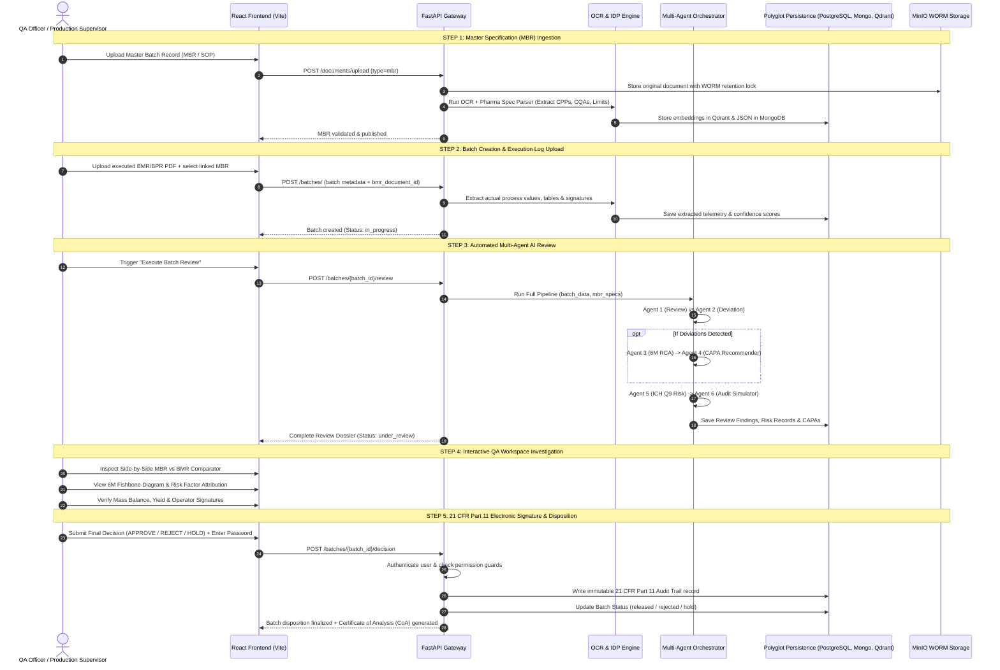

# 🧬 PharmaQA: Life Sciences Intelligent Quality Assurance & Batch Disposition Platform
## End-to-End Product Architecture, Multi-Agent AI System, and Workflow Guide

---

## 📑 Executive Summary

**PharmaQA Automation** is an enterprise-grade, FDA 21 CFR Part 11-compliant Quality Assurance platform designed specifically for the **Life Sciences and Pharmaceutical Manufacturing Industry**.

In modern pharmaceutical production, commercial batch release requires exhaustive verification of the **Batch Manufacturing Record (BMR)** against the validated **Master Batch Record (MBR)** and Standard Operating Procedures (SOPs). This manual review traditionally takes **5 to 14 days**, involves hundreds of pages of physical/scanned documents, and is susceptible to human oversight.

**PharmaQA** accelerates this lifecycle from days to under **15 minutes** by deploying a synchronized ecosystem of **6 specialized AI Agents** that perform holistic document review, detect deviations (OOS/OOT), execute automated Root Cause Analysis (RCA) via the 6M Ishikawa model, prescribe CAPAs, compute ICH Q9 batch risk scores, and simulate FDA/EMA regulatory audit inspections.

---

## 📚 1. Core Pharmaceutical Domain Glossary

| Term | Full Name | Regulatory Context & Description |
| :--- | :--- | :--- |
| **MBR** | Master Batch Record | The officially approved, validated recipe and manufacturing instructions defining all Critical Process Parameters (CPPs) and Critical Quality Attributes (CQAs). |
| **BMR / BPR** | Batch Manufacturing / Production Record | The actual execution log compiled during production on the factory floor, containing operator signatures, environmental readings, timestamps, equipment IDs, and yields. |
| **CPP** | Critical Process Parameter | A process parameter (e.g., blending speed, temperature, compression force) whose variability impacts a Critical Quality Attribute. |
| **CQA** | Critical Quality Attribute | A physical, chemical, or microbiological property (e.g., dissolution rate, assay potency, sterility) that must be within predefined limits to ensure product quality. |
| **OOS** | Out of Specification | A test result or measurement that falls outside the legally validated acceptance criteria established in the MBR/SOP. |
| **OOT** | Out of Trend | A test result or telemetry pattern that remains within acceptance limits but exhibits atypical statistical drift or variation. |
| **RCA** | Root Cause Analysis | A structured problem-solving methodology exploring the fundamental breakdown that caused a non-conformance. |
| **6M Model** | Ishikawa / Fishbone Framework | Investigation covering **Machine, Method, Material, Manpower, Measurement, and Environment**. |
| **CAPA** | Corrective & Preventive Action | System of systemic interventions designed to eliminate the causes of non-conformities and prevent recurrence. |
| **ICH Q9** | Quality Risk Management | International Council for Harmonisation guideline defining principles of risk assessment, control, review, and communication. |
| **21 CFR Part 11** | FDA Electronic Records & Signatures | Federal regulation establishing criteria under which electronic records and electronic signatures are considered equivalent to paper records. |
| **ALCOA+** | Data Integrity Standard | **A**ttributable, **L**egible, **C**ontemporaneous, **O**riginal, **A**ccurate + **C**omplete, **C**onsistent, **E**nduring, and **A**vailable. |

---

## 🤖 2. The 6 AI Agents: Deep Dive

PharmaQA utilizes a **hierarchical multi-agent framework** orchestrated by an asynchronous workflow coordinator. Each agent operates with specialized domain prompts, deterministic fallback rules, and private local LLM backends (Ollama / vLLM running Llama 3.1 / MedLlama models).

```
┌────────────────────────────────────────────────────────────────────────┐
│                   AGENT ORCHESTRATOR PIPELINE                          │
│                                                                        │
│   ┌──────────────────┐           ┌──────────────────┐                  │
│   │     Agent 1      │           │     Agent 2      │                  │
│   │   Review Agent   │──────────▶│ Deviation Agent  │                  │
│   │  (BMR vs MBR)    │           │ (OOS / OOT Scan) │                  │
│   └──────────────────┘           └────────┬─────────┘                  │
│                                           │ (If deviations found)      │
│                                           ▼                            │
│   ┌──────────────────┐           ┌──────────────────┐                  │
│   │     Agent 4      │           │     Agent 3      │                  │
│   │    CAPA Agent    │◀──────────│    RCA Agent     │                  │
│   │ (Prescriptions)  │           │ (6M Fishbone/5W) │                  │
│   └────────┬─────────┘           └──────────────────┘                  │
│            │                                                           │
│            ▼                                                           │
│   ┌──────────────────┐           ┌──────────────────┐                  │
│   │     Agent 5      │           │     Agent 6      │                  │
│   │    Risk Agent    │──────────▶│ Inspection Agent │                  │
│   │  (ICH Q9 Scores) │           │ (FDA Audit Sim)  │                  │
│   └──────────────────┘           └──────────────────┘                  │
└────────────────────────────────────────────────────────────────────────┘
```

---

### 1️⃣ Agent 1: Senior QA Reviewer Agent (`ReviewAgent`)
* **File Location**: [review_agent.py](file:///c:/Users/admin/Desktop/Projects/PharmaQA_Automation/PharmaProject/Backend/app/services/ai_agents/review_agent.py)
* **Domain Role**: Acts as a virtual Senior QA Auditor with 20+ years of cGMP experience.
* **Core Responsibilities**:
  * Holistic end-to-end comparison of actual BMR logged values against MBR specifications.
  * Cross-checking in-process parameters (temperature, pH, mixing speeds, drying cycles, tablet hardness).
  * Missing signature detection and verification of dual-operator sign-off chains.
  * Chronological consistency audit (verifying that preceding steps occurred before downstream steps).
  * Material reconciliation and mass balance calculations.
* **Outputs**:
  * `ai_advisory_status`: `COMPLIANT` | `NEEDS_REVIEW` | `NON_COMPLIANT`
  * Categorized findings list: `critical_findings`, `major_findings`, `minor_findings`.
  * `ai_recommendation`: `RECOMMEND_APPROVE` | `RECOMMEND_REJECT` | `RECOMMEND_CLARIFICATION`.
  * 21 CFR 211.22(c) Advisory Disclaimer (ensuring final disposition rests with human QA).

---

### 2️⃣ Agent 2: Deviation Detection Agent (`DeviationDetectionAgent`)
* **File Location**: [deviation_agent.py](file:///c:/Users/admin/Desktop/Projects/PharmaQA_Automation/PharmaProject/Backend/app/services/ai_agents/deviation_agent.py)
* **Domain Role**: Real-time excursion monitor and anomaly classifier.
* **Core Responsibilities**:
  * Evaluates parameter deviations beyond Upper/Lower Specification Limits ($$USL / LSL$$).
  * Runs statistical anomaly detection for Out-of-Trend (OOT) process behavior.
  * Classifies non-conformances into 4 operational categories:
    1. **Process**: Temperature spikes, blender speed drops, extended holding times.
    2. **Material**: Impurity excursions, moisture variances, raw material potency shifts.
    3. **Equipment**: Calibration expiry, seal leaks, pressure drop, sensor drift.
    4. **Human**: Incomplete entries, missing witness signatures, procedure skips.
  * Determines severity rating based on risk to Critical Quality Attributes (CQAs).
* **Outputs**:
  * Decision: `DEVIATIONS_FOUND` | `NO_DEVIATIONS`.
  * Structured list of classified deviations with parameter deltas, timestamps, and severity levels (`critical`, `major`, `minor`).

---

### 3️⃣ Agent 3: Root Cause Analysis (RCA) Agent (`RCAAgent`)
* **File Location**: [rca_agent.py](file:///c:/Users/admin/Desktop/Projects/PharmaQA_Automation/PharmaProject/Backend/app/services/ai_agents/rca_agent.py)
* **Domain Role**: Diagnostic investigator utilizing the 6M Ishikawa (Fishbone) model and 5-Whys methodology.
* **Core Responsibilities**:
  * Automatically activated when deviations are flagged by Agent 2.
  * Evaluates potential root causes across the **6Ms**:
    * **Machine**: Mechanical failure, calibration drift, seal wear.
    * **Method**: Procedure ambiguity, parameter tolerances, sampling frequency.
    * **Material**: Raw material lot variability, moisture content, supplier changes.
    * **Manpower**: Operator technique, fatigue, training gap, shift handover.
    * **Measurement**: Calibration bias, analytical method error, sensor failure.
    * **Environment**: Cleanroom differential pressure, HVAC temperature/humidity excursions.
  * Uses **RAG (Retrieval-Augmented Generation)** to query Qdrant Vector DB for similar historical deviations and known resolution patterns.
  * Formulates recursive 5-Whys causal chains.
* **Outputs**:
  * Probable root causes categorized by 6M branch.
  * Historical reference IDs (e.g., `DEV-2024-089`).
  * Confidence rating and structured causal reasoning.

---

### 4️⃣ Agent 4: CAPA Recommendation Agent (`CAPARecommendationAgent`)
* **File Location**: [capa_agent.py](file:///c:/Users/admin/Desktop/Projects/PharmaQA_Automation/PharmaProject/Backend/app/services/ai_agents/capa_agent.py)
* **Domain Role**: Prescriptive Quality Engineer recommending corrective and preventive action plans.
* **Core Responsibilities**:
  * Synthesizes root causes from Agent 3 into actionable, auditable CAPA tasks.
  * Differentiates between **Immediate Corrective Actions** (containment, batch isolation) and **Preventive Actions** (SOP revisions, re-calibration, operator retraining).
  * Computes **Predicted Effectiveness Score (0–100%)** based on historical CAPA recurrence rates.
  * Generates implementation roadmaps with estimated effort in days and priority classifications (`High`, `Medium`, `Low`).
* **Outputs**:
  * Structured CAPA items with title, action plan, action type, owner group, effort estimate, and predicted effectiveness %.

---

### 5️⃣ Agent 5: Risk Prediction Agent (`RiskPredictionAgent`)
* **File Location**: [risk_agent.py](file:///c:/Users/admin/Desktop/Projects/PharmaQA_Automation/PharmaProject/Backend/app/services/ai_agents/risk_agent.py)
* **Domain Role**: Quantitative Quality Risk Management engine compliant with **ICH Q9**.
* **Core Responsibilities**:
  * Extracts multi-dimensional telemetry vectors from batch data and agent findings.
  * Computes a normalized Batch Failure Risk Score ($$0.0 - 100.0$$) using weighted risk feature attribution:
    * **Critical Deviations Weight**: $$30\%$$
    * **Yield & Mass Balance Excursions**: $$20\%$$
    * **Process Parameter Excursions (OOS/OOT)**: $$15\%$$
    * **Major Deviations**: $$15\%$$
    * **Equipment Reliability & Maintenance Gaps**: $$7\%$$
    * **Environmental / Cleanroom Excursions**: $$5\%$$
    * **Minor Documentation / Signature Gaps**: $$5\%$$
    * **Data Integrity / ALCOA+ Flags**: $$3\%$$
  * Classifies risk tier:
    * **Low Risk ($$0.0 - 39.9$$)**: Standard fast-track release eligibility.
    * **Medium Risk ($$40.0 - 69.9$$)**: Enhanced QA review required.
    * **High Risk ($$70.0 - 100.0$$)**: High failure likelihood; prevents automated approval.
  * Produces SHAP-style explainable factor contributions detailing exactly which parameters increased batch risk.
* **Outputs**:
  * Quantitative Risk Score, Risk Category (`LOW`, `MEDIUM`, `HIGH`), RPN breakdown, and explainability chart data.

---

### 6️⃣ Agent 6: Regulatory Inspection Simulator (`InspectionSimulatorAgent`)
* **File Location**: [inspection_agent.py](file:///c:/Users/admin/Desktop/Projects/PharmaQA_Automation/PharmaProject/Backend/app/services/ai_agents/inspection_agent.py)
* **Domain Role**: Virtual FDA / EMA cGMP Inspector simulating an on-site regulatory audit.
* **Core Responsibilities**:
  * Evaluates batch records against **FDA 21 CFR Part 211** cGMP sections:
    * § 211.22 (Quality control unit responsibilities)
    * § 211.68 (Automatic, mechanical, and electronic equipment)
    * § 211.100 (Written procedures and deviations)
    * § 211.160 (General laboratory controls)
    * § 211.186 & § 211.192 (Batch production record review & unexplained discrepancies)
  * Evaluates **FDA 21 CFR Part 11** electronic record compliance (signature linkage, audit trails).
  * Validates **ALCOA+ Data Integrity Principles** (Attributable, Legible, Contemporaneous, Original, Accurate, Complete, Consistent, Enduring, Available).
  * Generates an **Audit Readiness Score ($$0 - 100\%$$)** and flags potential FDA 483 inspection observations.
* **Outputs**:
  * Audit Readiness Score, cGMP Compliance Checklist status, ALCOA+ Gap Analysis, and Simulated Inspection Observations.

---

## 🔄 3. End-to-End Workflow (Start to End)



---

### Step-by-Step Breakdown:

#### 🟢 Step 1: Master Specification (MBR) Setup
1. Standard Master Batch Records (MBR) and SOPs are ingested into the platform.
2. The **Pharma Spec Parser** extracts:
   * Upper Specification Limits (USL) and Lower Specification Limits (LSL).
   * Bill of Materials (BOM) with theoretical quantities.
   * In-process control stages (Dispensing, Granulation, Compression, Coating, Packaging).
3. Text chunks and specification tables are embedded using `SentenceTransformers` and indexed in **Qdrant Vector DB**.

#### 🟢 Step 2: Executed Batch Record (BMR) Ingestion
1. When a manufacturing batch concludes, the operator/QA uploads the executed BMR document.
2. The user selects:
   * **Batch Number** (e.g., `BATCH-2026-089A`)
   * **Product Code & Name** (e.g., `PRD-001 - Paracetamol 500mg Tablets`)
   * **Manufacturing Date**
   * **Linked MBR Version** (selected from dropdown)
3. Document is stored in **MinIO WORM storage** (Write Once, Read Many) ensuring FDA data integrity.
4. OCR and table extraction convert scanned pages into structured JSON telemetry.

#### 🟢 Step 3: Multi-Agent AI Orchestration
1. QA initiates batch review via the UI.
2. **Agent 1 (Review Agent)** maps actual readings against MBR target values.
3. **Agent 2 (Deviation Agent)** detects any out-of-spec or out-of-trend conditions.
4. If deviations are present:
   * **Agent 3 (RCA Agent)** constructs a 6M Ishikawa tree and matches historical cases via RAG.
   * **Agent 4 (CAPA Agent)** generates action plans with predicted effectiveness percentages.
5. **Agent 5 (Risk Agent)** calculates ICH Q9 batch risk score (0–100) and SHAP factor breakdown.
6. **Agent 6 (Inspection Agent)** runs 21 CFR Part 211 checklist and ALCOA+ integrity evaluation.
7. Backend calculates **Overall Compliance Score** ($$0 - 100\%$$) and sets batch status to `under_review`.

#### 🟢 Step 4: Visual QA Investigation Workspace
1. QA reviewer navigates to the interactive **Batch Detail Hub**.
2. **MBR vs. BMR Visual Comparator**: View discrepancies with color coding (Green: Pass, Amber: Advisory, Red: OOS Excursion).
3. **Yield & Reconciliation Module**: Check actual yield against theoretical mass balance limits ($$\text{Mass Balance Gap} < 2.0\%$$).
4. **Interactive 6M Fishbone Diagram**: Drill into root cause categories (Machine, Method, Material, etc.).
5. **ICH Q9 Risk Matrix**: Interactive gauge showing risk drivers and failure probability.

#### 🟢 Step 5: 21 CFR Part 11 Electronic Signature & Final Disposition
1. QA Officer selects the final disposition:
   * **APPROVE**: Releases batch for commercial distribution. Blocked if unresolved critical deviations exist. Status transitions to `released`.
   * **REJECT**: Formally rejects batch. Requires mandatory documented justification. Status transitions to `rejected`.
   * **HOLD**: Places batch under quarantine pending investigation. Status transitions to `hold`.
2. **Dual-Factor E-Signature**: User re-enters their password, confirms the legal meaning of signature, and submits.
3. Backend writes an immutable entry into the **Audit Trail** with timestamp, user ID, IP address, and cryptographic signature digest.

---

## 🏛️ 4. System Architecture & Tech Stack

```
┌────────────────────────────────────────────────────────────────────────┐
│                   FRONTEND: React 18 + Vite + TypeScript               │
│  - Interactive Dashboard         - MBR vs BMR Visual Comparator        │
│  - Deviation & CAPA Tracking     - Interactive 6M Fishbone / D3        │
│  - 21 CFR Part 11 E-Signature    - Audit Trail & Risk Analytics        │
└───────────────────────────────────┬────────────────────────────────────┘
                                    │ REST API / JWT Authentication
┌───────────────────────────────────▼────────────────────────────────────┐
│                    BACKEND: FastAPI (Python 3.11+)                     │
│  ┌──────────────────────────────────────────────────────────────────┐  │
│  │ API Endpoints (Batches, Documents, Deviations, CAPAs, Agents)    │  │
│  └──────────────────────────────────────────────────────────────────┘  │
│  ┌──────────────────────────────────────────────────────────────────┐  │
│  │ AI Multi-Agent Orchestrator (LangChain / Ollama / Local LLMs)    │  │
│  │ [Review] ──▶ [Deviation] ──▶ [RCA] ──▶ [CAPA] ──▶ [Risk] ──▶ [Audit]│
│  └──────────────────────────────────────────────────────────────────┘  │
│  ┌──────────────────────────────────────────────────────────────────┐  │
│  │ Services Layer (IDP OCR, Spec Parser, Unit Normalizer, Audit)    │  │
│  └──────────────────────────────────────────────────────────────────┘  │
└───────────────────────────────────┬────────────────────────────────────┘
                                    │
┌───────────────────────────────────▼────────────────────────────────────┐
│                       POLYGLOT PERSISTENCE LAYER                       │
│  ┌───────────────┐ ┌───────────────┐ ┌───────────────┐ ┌─────────────┐ │
│  │  PostgreSQL   │ │    MongoDB    │ │ Qdrant Vector │ │  MinIO/S3   │ │
│  │ Relational DB │ │ JSON IDP Docs │ │ Semantic RAG  │ │ WORM Files  │ │
│  └───────────────┘ └───────────────┘ └───────────────┘ └─────────────┘ │
└────────────────────────────────────────────────────────────────────────┘
```

### Component Details:
* **Frontend**: React 18, TypeScript, Vite, Tailwind CSS / Vanilla CSS, Lucide Icons, Chart.js.
* **Backend Gateway**: FastAPI (Python 3.11+), Pydantic v2 validation models, Async SQLAlchemy ORM.
* **AI & LLM Engine**: LangChain, Ollama / vLLM runtime hosting local private LLMs (Llama 3.1 8B/70B, MedLlama) ensuring **zero sensitive pharma data leaves the on-premise perimeter**.
* **Vector DB (RAG)**: Qdrant Vector DB storing embeddings of historical deviations, SOPs, and CAPAs for real-time similarity matching.
* **Polyglot Persistence**:
  * **PostgreSQL**: Users, roles, batch metadata, deviations, CAPAs, and 21 CFR Part 11 audit records.
  * **MongoDB**: Raw OCR text, extracted JSON structures, IDP token confidence maps.
  * **Redis**: Caching, rate limiting, token blacklists, session locks.
  * **MinIO**: S3-compatible WORM (Write Once, Read Many) tamper-proof document storage.

---

## 🔒 5. Regulatory Compliance & Data Integrity

PharmaQA is architected to adhere strictly to international Life Sciences standards:

### 1. FDA 21 CFR Part 11 (Electronic Records & Electronic Signatures)
* **Re-Authentication**: Mandatory password entry for every batch disposition decision.
* **Signature Manifestation**: Printed name of signer, UTC timestamp, and declared meaning of signature embedded permanently into the record.
* **Tamper-Evident Audit Trails**: System logs every creation, modification, review, and deletion with user ID, IP address, before-value, and after-value.

### 2. FDA 21 CFR Part 210 & 211 (cGMP in Pharmaceutical Manufacturing)
* **§ 211.192**: Requires comprehensive investigation of any unexplained discrepancy or batch failure.
* **Advisory AI Guardrail (§ 211.22(c))**: The AI system acts **strictly as an advisory tool**. All dispositions require human Quality Unit authorization.

### 3. ALCOA+ Data Integrity Principles
* **Attributable**: Every action, OCR scan, AI analysis, and sign-off traces to an authenticated user ID.
* **Legible**: Documents and extraction records are structured and readable.
* **Contemporaneous**: All timestamps are recorded synchronously via Network Time Protocol (NTP).
* **Original**: Raw uploaded documents are stored in immutable WORM storage.
* **Accurate**: IDP extraction includes token-level confidence metrics and validation checks.
* **Complete, Consistent, Enduring, Available**: Preserved across polyglot persistent databases with automated backups.

---

## 🖥️ 6. Frontend Pages & User Interface Modules

| Screen / Module | Description & User Capabilities |
| :--- | :--- |
| **Executive Dashboard** | Real-time overview of batches under review, open deviations, average release cycle time, high-risk alerts, and compliance trend charts. |
| **Document Intelligence (IDP)** | Ingestion portal for MBRs and SOPs with OCR confidence visualizer and automated parameter spec extraction. |
| **Batch Upload & Linking** | Stepper-based upload for BMR PDFs with searchable MBR version selection and validation checks. |
| **Batch Repository** | Filterable table showing Batch Number, Product, Linked MBR, Status, Risk Tier, and Review actions. |
| **Batch Detail & Review Hub** | Central review workspace featuring: <br>• Side-by-side MBR vs. BMR comparator with color-coded deltas <br>• Yield & mass balance breakdown <br>• Signature verification checklist |
| **Deviation & CAPA Hub** | Interactive 6M Fishbone (Ishikawa) diagram, 5-Whys root cause progression, and CAPA task assignment. |
| **Risk Register (ICH Q9)** | Heat map risk matrix, RPN scoring, and SHAP factor attribution breakdown. |
| **Audit & 21 CFR Part 11 Log** | Searchable, tamper-evident audit trail viewer with exportable regulatory inspection reports. |

---

## 📈 7. Summary of Key Business Outcomes

1. **Cycle Time Acceleration**: Reduces batch review cycle from **5–14 days down to under 15 minutes**.
2. **Quality Assurance Precision**: 100% automated scanning of all Critical Process Parameters and Quality Attributes.
3. **Institutional Memory**: RAG-powered vector search surfaces past deviation solutions instantly to prevent recurring issues.
4. **Audit Readiness**: Built-in FDA/EMA inspection simulation proactively identifies compliance gaps before external audits.
